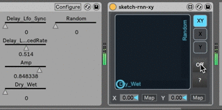

# Sketch-RNN-controlled Max4Live XY pad

A Sketch-RNN model draws birds on an XY pad in Ableton Live. Because I'm too lazy to control the pad myself. See it in action: https://vimeo.com/275539143

I basically attached Google Magenta's [Sketch-RNN-JS](https://github.com/tensorflow/magenta-demos/tree/master/sketch-rnn-js) [bird generation model](https://storage.googleapis.com/quickdraw-models/sketchRNN/models/bird.gen.js) to [XY Pad Snap-Mod 1.0](http://www.maxforlive.com/library/device/2792/xy-pad-snap-mod) by [Krypt1k](https://www.krypt1k.com/). 

Adam Murray's [JavaScript Live API Tutorials](http://compusition.com/writings/js-live-api) and Johnny Snelgrove's [midi thru js fn](https://github.com/jsnelgro/midi-thru-js-fn) were very helpful in attempting to run js in Max. 

I stripped out p5.js-related lines since I don't need to draw actual lines (not even sure if Max supports canvas). Also Max apparently doesn't know how to deal with import or XMLHTTPRequest, so I had to merge all scripts into a single js file.

Also made a change to the original m4l patch [so that every parameter change does not land on the undo history](https://cycling74.com/forums/parameter-modulation-without-adding-to-undo-history/). 

## How to use

- Download and unzip this folder. (https://github.com/achimkoh/m4l-sketch-rnn-xy/releases) 
- Drag and drop the .amxd file in your Ableton Live project, where it is convenient (this is an Audio Effect). 
- Note: the .amxd file and the .js file need to be in the same folder.
- Click one of the 'Map' buttons and then click to some parameter in Live that you want the pad to control. Do the same with the other button. 
- The on/off trigger shows 'Off' by default; click on it to let the neural net start drawing on your xy controller.

## To do

- drawing speed control (currently triggered every 50ms)
- temperature control
- select models (not sure if this is actually possible. I might have to resort to creating multiple instruments?)
